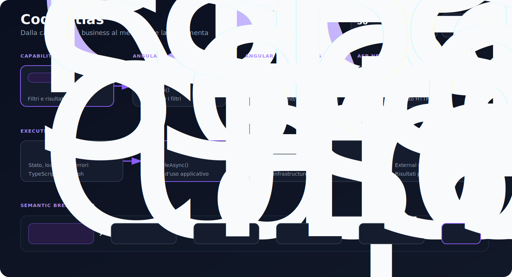

# Code Atlas

**Semantic code cartography** per repository TypeScript/Angular e C#/.NET. L'obiettivo è passare dalla capability di business al singolo metodo senza leggere il progetto file per file.

## Anteprima



## Cosa produce

- **Capability map** e **use case map** tramite annotazioni leggere `@atlas`.
- **Call graph statico** ricavato da TypeScript AST e analisi C# iniziale.
- **Bridge frontend/backend** attraverso endpoint HTTP condivisi.
- **Architecture map** per layer: Presentation, Application, Domain, Infrastructure.
- **Execution flow** cross-stack, ad esempio Angular component → facade → API client → endpoint ASP.NET → handler → repository.
- **Report HTML interattivo** e grafo JSON riutilizzabile da altri viewer.

## Installazione locale

```bash
npm install
npm run check
```

Il comando esegue build, test e analisi del progetto demo.

## CLI

```bash
npx @raffica93/code-atlas analyze ./percorso-progetto \
  --out ./artifacts/atlas.json \
  --html ./artifacts/report.html \
  --name "Nome progetto"
```

## API della libreria

```ts
import { analyzeProject, renderHtmlReport } from '@raffica93/code-atlas';
import { writeFile } from 'node:fs/promises';

const graph = await analyzeProject('./my-project');
await writeFile('atlas.json', JSON.stringify(graph, null, 2));
await writeFile('atlas.html', renderHtmlReport(graph));
```

## Annotazioni semantiche

Le annotazioni collegano il codice al dominio. Sono opzionali, ma aumentano la qualità della mappa:

```ts
// @atlas capability: Ricerca posizioni
// @atlas use-case: Eseguire ricerca posizioni
// @atlas layer: presentation
// @atlas summary: Pagina che raccoglie i filtri e avvia la ricerca.
```

L'analisi strutturale resta automatica: classi, metodi, call graph, route ASP.NET e chiamate HTTP vengono estratti dal codice.

## Output del progetto demo

Il progetto demo `examples/demo-angular-dotnet` ricostruisce questo percorso:

```text
SearchPageComponent.onSearch()
  → SearchFacade.search()
  → PositionsApiClient.search()
  → POST /api/positions/search
  → PositionsController.Search()
  → SearchPositionsHandler.HandleAsync()
  → PositionsRepository.SearchAsync()
```

## Limiti consapevoli dell'MVP

Il parser C# è intenzionalmente leggero e non sostituisce Roslyn. La roadmap prevede un analyzer Roslyn dedicato, risoluzione DI completa, symbol graph persistente, OpenTelemetry runtime traces e plugin per framework aggiuntivi.

## Roadmap

1. Parser Roslyn come sidecar .NET.
2. Risoluzione import/DI Angular e ASP.NET.
3. Change impact analysis basata su Git diff.
4. Persistenza graph database.
5. Runtime overlay tramite OpenTelemetry.
6. Query semantiche in linguaggio naturale.

## Licenza

MIT.
